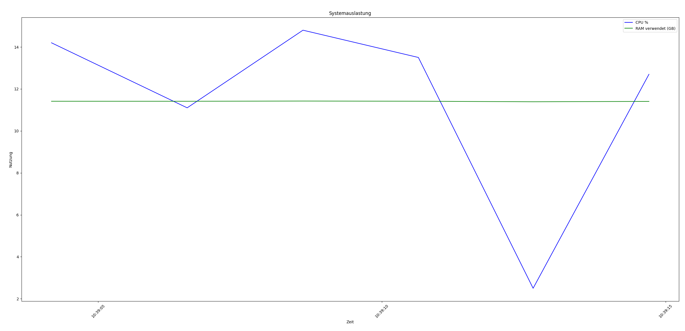

# Dokumentation mit dem Code und dem Power Statistik Graphen
## Power Statistics Abspeichern

### Code DB Aufbau und verbindung

```py
client = MongoClient("mongodb://localhost:27017")
    db = client["power_stats"]
    collection = db["logs"]
```

### Code DB Objekt Aufbau

```py
"cpu": self.cpu,
"ram_total": self.ram_total,
"ram_used": self.ram_used,
"timestamp": self.timestamp
```

### Code Timer für Sequenzielle abspeicherungen

```py
while True:
    log_power_stats()
    time.sleep(1)

```

## Power Statistics Graph ausgebn

### Erstellung vom Graphen

```py
plt.figure(figsize=(12, 6))
plt.plot(timestamps, cpu_values, label="CPU %", color="blue")
plt.plot(timestamps, ram_used, label="RAM verwendet (GB)", color="green")
plt.xlabel("Zeit")
plt.ylabel("Nutzung")
plt.title("Systemauslastung")
plt.legend()
plt.xticks(rotation=45)
plt.tight_layout()
```

### Graph in PNG abspeichern

```py
plt.savefig("systemauslastung.png")
```

### Unser Graph beim testen der Applikation
Das Bild ist im Ordner der Aufgabe 5 abgespeichert (systemauslastung.png)




